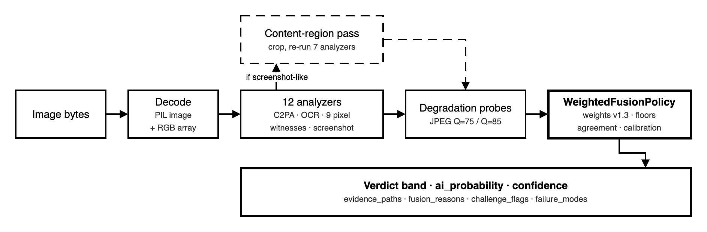

# AI Image Authenticator

**Local-first, explainable examiner for AI-generated and synthetic images.**

Upload an image to run a **twelve-analyzer** forensic ensemble (Content Credentials / C2PA, OCR disclosures, classical pixel forensics). Results include per-signal findings, evidence paths, challenge flags, and optional visualizations — not a single opaque score.

| | |
|---|---|
| **Stack** | FastAPI · React/Vite · Clean Architecture monorepo |
| **API** | `/api/v1` |
| **License** | [MIT](./LICENSE) |

---

## Why this exists

Platform labels such as X’s **Made with AI** are applied at upload, when **C2PA / Content Credentials** can still be read (X has not documented its exact mechanism). Downloads and screenshots **strip** that metadata — a 2026 study of 10,217 AI images found Twitter’s CDN systematically strips it ([arXiv:2604.25370](https://arxiv.org/abs/2604.25370)) — so a local examiner must also read **visible badges (OCR)** and **pixel forensics**.

This project is an **investigative tool**, not courtroom proof and not a substitute for expert testimony.

**Out of scope (by design):**

- Decoding proprietary watermarks (e.g. Google SynthID) without provider keys  
- Claiming equivalence to any platform’s upload labeling pipeline  
- Publishing GenImage / NTIRE leaderboard scores for this repository  

Industry practice is often **dual-layer** (C2PA + SynthID-class watermarks). We inspect the **C2PA / OCR / classical forensics** side and surface honest `challenge_flags` / `failure_modes` when limits apply. See [docs/research-challenges.md](./docs/research-challenges.md).

---

## Quick start

**Requirements:** Python 3.12+ ([uv](https://github.com/astral-sh/uv)), Node.js 20+, optional [Tesseract OCR](https://github.com/tesseract-ocr/tesseract) (`brew install tesseract`).

```bash
git clone https://github.com/santoshshinde2012/ai-image-authenticators.git
cd ai-image-authenticator
cp .env.example .env   # optional
uv sync --all-groups
cd apps/web && npm ci && cd ../..
```

**Development (two terminals):**

```bash
# API
uv run uvicorn ai_image_authenticator.main:app --host 127.0.0.1 --port 8000 --reload

# UI (proxies /api → :8000)
cd apps/web && npm run dev
```

Open **http://127.0.0.1:5173** · Health: `GET http://127.0.0.1:8000/api/v1/health`

**Single-port (API serves built UI):**

```bash
cd apps/web && npm ci && npm run build && cd ../..
uv run uvicorn ai_image_authenticator.main:app --host 0.0.0.0 --port 8000
```

**Docker:**

```bash
docker compose up --build
# → http://127.0.0.1:8000
```

Helpers: `./scripts/run-api.sh`, `./scripts/run-dev.sh`

---

## Features

- **Twelve independent analyzers** with human-readable findings and optional viz maps  
- **C2PA / Content Credentials** — PNG `caBX`, JPEG JUMBF/APP11, WebP; generative `digitalSourceType` per the C2PA conformance rubric, read from manifest bytes only; optional `c2pa-python` signature + hard-binding validation  
- **OCR** for visible “Made with AI” / generator badges (Al/A1 hardening)  
- **Screenshot path** — chrome detection + content-region reanalysis  
- **Written fusion policy** — evidence paths (`provenance_contract`, `pixel_forensic`, `screenshot_path`), verdict bands, challenge awareness  
- **Research-aligned flags** — `challenge_flags` + `failure_modes` (laundering probe, dual-layer awareness, conflict calibration)  
- **Production basics** — settings/CORS, upload validation, 50 MP decoded-size cap, security headers, request IDs, health/ready, Docker + Compose, CI  
- **Offline-first v1** — classical ensemble; no model download required  

---

## Pipeline



*Decode, twelve analyzers, an optional content-region pass for screenshots, JPEG probes, then the fusion policy. Source: [`docs/diagrams/pipeline.drawio`](./docs/diagrams/pipeline.drawio).*

| Analyzer | Weight | Focus |
|---|---:|---|
| Metadata Forensics | 0.05 | EXIF / AI software fingerprints |
| Content Credentials (C2PA) | 0.10 | Manifests, `digitalSourceType` |
| Visible AI Labels (OCR) | 0.14 | On-image disclosures |
| Error Level Analysis | 0.09 | Recompression residuals |
| Frequency Spectrum (FFT) | 0.10 | Durall-style azimuthal / HF cues |
| DCT / JPEG Statistics | 0.07 | AC / Benford / periodicity |
| Noise Residual | 0.07 | Wavelet / Laplacian residuals |
| SRM Residuals | 0.11 | High-pass residual bank |
| Bayar Prediction Residual | 0.07 | Constrained prediction-error map |
| Local Correlation / Upsampling | 0.09 | Neighbor correlation / NPR-style residue |
| Texture & Gradient | 0.07 | Gradient / entropy / GLCM |
| Screenshot Heuristic | 0.04 | UI chrome → content reanalysis |

Weights are the SSOT in [`weights.py`](./apps/api/src/ai_image_authenticator/application/services/weights.py) and [docs/weights.md](./docs/weights.md).

**Verdict bands:** `real` &lt; 0.35 · `inconclusive` 0.35–0.55 · `likely_ai` 0.55–0.75 · `ai_generated` ≥ 0.75

---

## Analyze via API

```bash
curl -s -F "file=@samples/synthetic-smooth.png" \
  http://127.0.0.1:8000/api/v1/analyze \
  | jq '{verdict, ai_probability, confidence, evidence_paths, challenge_flags, failure_modes}'
```

| Method | Path | Role |
|---|---|---|
| `GET` | `/api/v1/health` | Liveness |
| `GET` | `/api/v1/ready` | Readiness + analyzer registry |
| `POST` | `/api/v1/analyze` | Multipart image analysis |
| `GET` | `/api/v1/artifacts/{id}` | Short-TTL visualization bytes |

Local benchmark harness: `uv run python scripts/run_local_benchmark.py` → [docs/benchmarks.md](./docs/benchmarks.md)

---

## Project layout

```
apps/api/     Clean Architecture FastAPI app (domain · application · infrastructure · interfaces)
apps/web/     React + Vite UI
docs/         Architecture, system design, references, challenges, benchmarks
              (draw.io sources in `docs/diagrams/`, PNGs in `docs/assets/`)
samples/      Example images + benchmark JSON
scripts/      Dev helpers, local benchmark runner, draw.io diagram export
```

SOLID / DI overview: [docs/architecture.md](./docs/architecture.md) · Naming: [docs/naming-conventions.md](./docs/naming-conventions.md)

---

## Documentation

| Document | Description |
|---|---|
| [docs/README.md](./docs/README.md) | Documentation index |
| [docs/system-design.md](./docs/system-design.md) | Living E2E design (matches code) |
| [docs/research-challenges.md](./docs/research-challenges.md) | Research challenges → solutions |
| [docs/references.md](./docs/references.md) | Verified bibliography |
| [docs/benchmarks.md](./docs/benchmarks.md) | Measured local benchmarks only |
| [docs/weights.md](./docs/weights.md) | Fusion weight contract |
| [docs/contributing.md](./docs/contributing.md) | Contribute / add an analyzer |

---

## Configuration

Settings use the `AIAUTH_` prefix (see [`.env.example`](./.env.example)).

| Variable | Default | Purpose |
|---|---|---|
| `AIAUTH_HOST` | `127.0.0.1` | Bind address |
| `AIAUTH_PORT` | `8000` | Bind port |
| `AIAUTH_ENVIRONMENT` | `dev` | `prod` hides decoder error details in API responses |
| `AIAUTH_CORS_ORIGINS` | localhost UI/API | Comma-separated origins |
| `AIAUTH_MAX_UPLOAD_BYTES` | `26214400` | Upload size cap (25 MB) |
| `AIAUTH_MAX_IMAGE_PIXELS` | `50000000` | Decoded-size cap, checked before decoding (413 above it) |
| `AIAUTH_ARTIFACT_TTL_SECONDS` | `3600` | Visualization TTL |
| `AIAUTH_ARTIFACT_MAX_ENTRIES` | `256` | Max in-memory artifacts |
| `AIAUTH_LOG_LEVEL` | `INFO` | Log level |
| `AIAUTH_ALLOWED_CONTENT_TYPES` | jpeg,png,webp,gif,avif | Upload allowlist (HEIC unsupported) |
| `AIAUTH_FRONTEND_DIST` | _(auto)_ | SPA build path (Docker sets this) |

Optional C2PA validation: `uv sync --extra c2pa` (signature + hard binding; remote manifest fetch disabled)

---

## Tests

```bash
uv sync --all-groups
uv run ruff check apps/api/src apps/api/tests
uv run pytest -q
cd apps/web && npm ci && npm run build
```

---

## Security & ethics

- Images are processed **in-process**; v1 artifacts are an **in-memory** TTL cache, not durable cloud storage.  
- Uploads are checked by content-type allowlist and magic-byte sniff; oversized payloads (bytes or decoded pixels) are rejected before they are decoded.  
- Responses include `X-Request-ID` and standard browser security headers.  
- C2PA claims only count from inside a manifest container. The optional `c2pa-python` reader validates signature and hard binding; no trust list is configured, so a manifest can be `Valid` but is never reported `Trusted`.  
- Do not treat outputs as legal authentication of evidence.

---

## Contributing

See [docs/contributing.md](./docs/contributing.md). New analyzers: implement the `Analyzer` port, register in `container.py`, update weights + docs, add tests.

---

## License

[MIT](./LICENSE)
