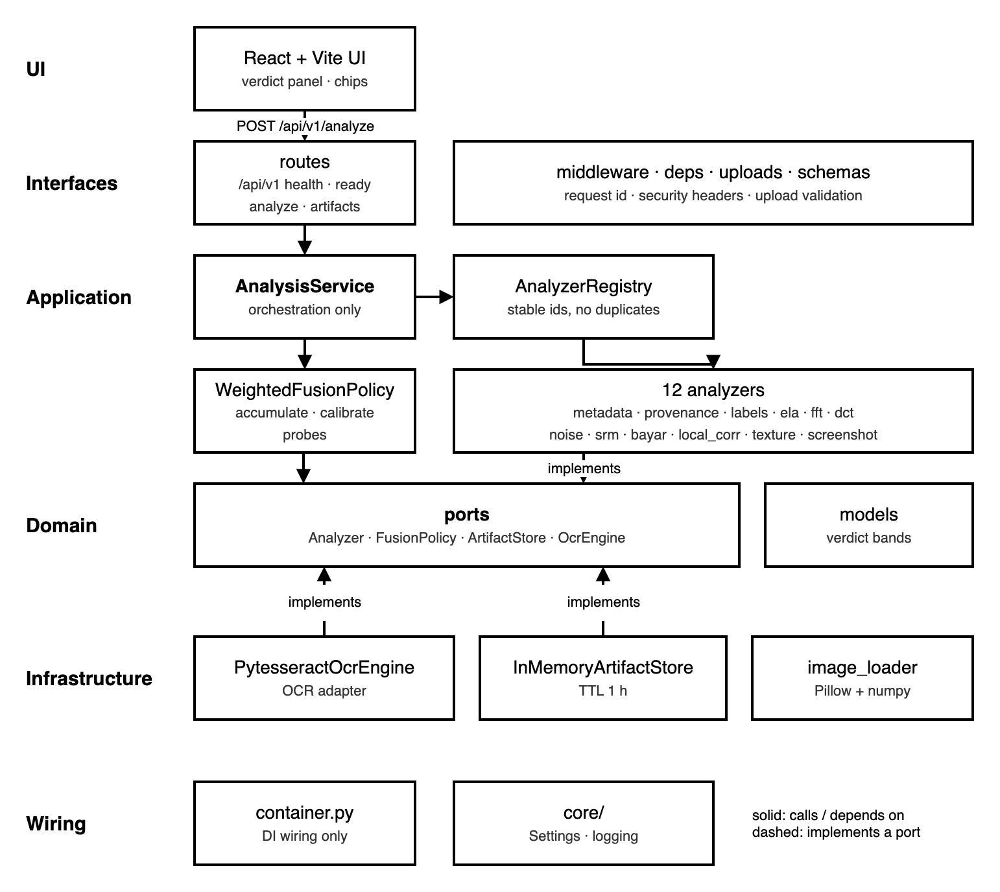

# Architecture

AI Image Authenticator uses a **monorepo** (`apps/api` + `apps/web`), an **installable Clean Architecture / hexagonal `src` layout**, and **SOLID** boundaries so forensic signals stay independent, fusion stays replaceable, and HTTP stays thin.

## Monorepo map

```
ai-image-authenticator/
  apps/
    api/                          # FastAPI package
      src/ai_image_authenticator/
      tests/
    web/                          # Vite + React feature layout
  docs/
  scripts/
  samples/
  Dockerfile                      # multi-stage API + web
  pyproject.toml                  # hatch packages apps/api/src
```

## Layering (API package)



*Dependencies point inward: interfaces call the application, the application depends on domain ports, and infrastructure implements them. Source: [`diagrams/layering.drawio`](./diagrams/layering.drawio).*

| Layer | Path | Responsibility |
|---|---|---|
| Core | `core/` | `config.py` (Settings), `logging.py` |
| Domain | `domain/` | Ports (`Analyzer`, `ArtifactStore`, `FusionPolicy`, `OcrEngine`), models, verdict |
| Application | `application/analyzers/` | One class per signal + `AnalyzerRegistry` (OCP) |
| Application | `application/services/` | `AnalysisService` orchestration, `WeightedFusionPolicy` |
| Infrastructure | `infrastructure/` | In-memory artifacts, Pillow loader, OCR adapter |
| Interfaces | `interfaces/http/` | deps, middleware, uploads, schemas |
| Interfaces | `interfaces/http/v1/` | Versioned routes mounted at `/api/v1` |
| Container | `container.py` | DI wiring only |
| Entry | `main.py` | `create_app()`; mounts `/api/v1` before SPA |

## Analyzer registry (stable ids)

Twelve analyzers register in `container.build_registry()`. Fusion weights and the UI use the same `id` keys:

| `id` | Class | Display `name` | Research cue |
|---|---|---|---|
| `metadata` | `MetadataForensics` | Metadata Forensics | EXIF / PNG text / AI software tags |
| `provenance` | `ProvenanceC2PA` | Content Credentials (C2PA) | Reader + validation_state (optional); marker fallback |
| `labels` | `VisibleLabelOCR` | Visible AI Labels (OCR) | Made-with-AI badges (screenshot path) |
| `ela` | `ErrorLevelAnalysis` | Error Level Analysis | Multi-quality recompression residual |
| `fft` | `FrequencySpectrum` | Frequency Spectrum (FFT) | Durall azimuthal avg, log-log slope, HF ratio |
| `dct` | `DCTJpegStats` | DCT / JPEG Statistics | AC periodicity / flatness |
| `noise` | `NoiseResidual` | Noise Residual | Wavelet / cross-channel residual |
| `srm` | `SRMResidualAnalyzer` | SRM Residuals | Fridrich & Kodovský / TRIDENT residual bank |
| `bayar` | `BayarPredictionResidual` | Bayar Prediction Residual | Constrained 3×3 prediction-error map |
| `local_corr` | `LocalCorrelationAnalyzer` | Local Correlation / Upsampling | NPR-style upsampling residue + neighbor corr |
| `texture` | `TextureGradient` | Texture & Gradient | GLCM / gradient energy |
| `screenshot` | `ScreenshotHeuristic` | Screenshot Heuristic | UI chrome → content reanalysis |

Evidence paths (API `evidence_paths`): `provenance_contract`, `pixel_forensic`, `screenshot_path`.

## Frontend (feature-based)


```
apps/web/src/
  app/                  # App.tsx, main.tsx
  features/analysis/    # api.ts, types.ts, components/*
  shared/styles/        # index.css
  assets/
```

## SOLID mapping

- **S — Single Responsibility:** each analyzer only scores; `WeightedFusionPolicy` only fuses; routes only HTTP; `ArtifactStore` only stores bytes.
- **O — Open/Closed:** add a signal by implementing `Analyzer` and `registry.register(...)` in `container.py` — fusion weights can gain a key without rewriting orchestration.
- **L — Liskov Substitution:** all analyzers share the `Analyzer` port / `BaseAnalyzer` contract (`analyze(...) -> AnalyzerOutput`).
- **I — Interface Segregation:** small ports (`Analyzer`, `ArtifactStore`, `FusionPolicy`, `OcrEngine`) instead of a god-service interface.
- **D — Dependency Inversion:** `AnalysisService` depends on port sequences + `FusionPolicy` + `ArtifactStore`; concrete classes are wired in `container.py`.

## HTTP versioning

All API endpoints live under **`/api/v1`**:

| Method | Path | Purpose |
|---|---|---|
| GET | `/api/v1/health` | Liveness |
| GET | `/api/v1/ready` | Readiness (analyzers + container) |
| POST | `/api/v1/analyze` | Multipart image analysis |
| GET | `/api/v1/artifacts/{id}` | Visualization bytes |

The web client calls `/api/v1/...` (Vite proxies `/api` → `:8000`).

## Production concerns

| Concern | Module | Notes |
|---|---|---|
| Settings | `core/config.py` | `pydantic-settings` (`AIAUTH_*`): host/port, CORS, upload limits, artifact TTL/max, log level, content-type allowlist, environment |
| Logging | `core/logging.py` | Structured configure_logging |
| Middleware | `interfaces/http/middleware.py` | Request ID + security headers |
| Uploads | `interfaces/http/uploads.py` | Size + content-type + magic-byte validation |
| Probes | `interfaces/http/v1/routes.py` | `/api/v1/health`, `/api/v1/ready` |

`create_app()` wires CORS from settings, registers **versioned** API routes **before** mounting `apps/web/dist` (SPA fallback), and returns consistent JSON error bodies (`error`, `status_code`, `detail`, `request_id`).


## Fusion weights (v1.3 research-grade)

Weights sum to **1.0**. Absent C2PA is down-weighted to ~0.01 so it does not dilute pixel forensics. Scores are confidence-normalized before the weighted sum; OCR/C2PA hard floors and forensic agreement boost remain.

| id | weight |
|---|---:|
| metadata | 0.05 |
| provenance | 0.10 |
| labels | 0.14 |
| ela | 0.09 |
| fft | 0.10 |
| dct | 0.07 |
| noise | 0.07 |
| srm | 0.11 |
| bayar | 0.07 |
| local_corr | 0.09 |
| texture | 0.07 |
| screenshot | 0.04 |

Trust-anchor honesty: optional `c2pa-python` Reader may expose `validation_state` / `digitalSourceType`, but trust-anchor fetch is **off by default** (CI stays offline). Marker fallback always runs.

## Honesty vs industry dual-layer (2026)

Industry producers increasingly ship **dual-layer** provenance: **C2PA Content Credentials** (inspectable manifests, `digitalSourceType`, actions) plus **SynthID-class** invisible watermarks. This repository:

- Implements the **C2PA / OCR / classical forensics** examiner path with explainable visualizations.
- Does **not** decode proprietary SynthID keys.
- Treats **absent C2PA** as expected after re-encode/screenshot (down-weighted in fusion), not as proof of authenticity.
- Documents that X’s Made with AI appears **C2PA-oriented at upload**, while independent tests (e.g. Roboin 2026) suggest **undisclosed criteria** may also apply — do not overclaim C2PA-only.

Weights live in `application/services/weights.py` (`fusion.py` only re-exports them). Hard floors, the forensic agreement boost/dampener and evidence paths are in `fusion_policy.py`; weight accumulation and laundering dampening in `fusion_accumulate.py`; challenge calibration in `fusion_calibrate.py` and `challenge_flags.py`.
